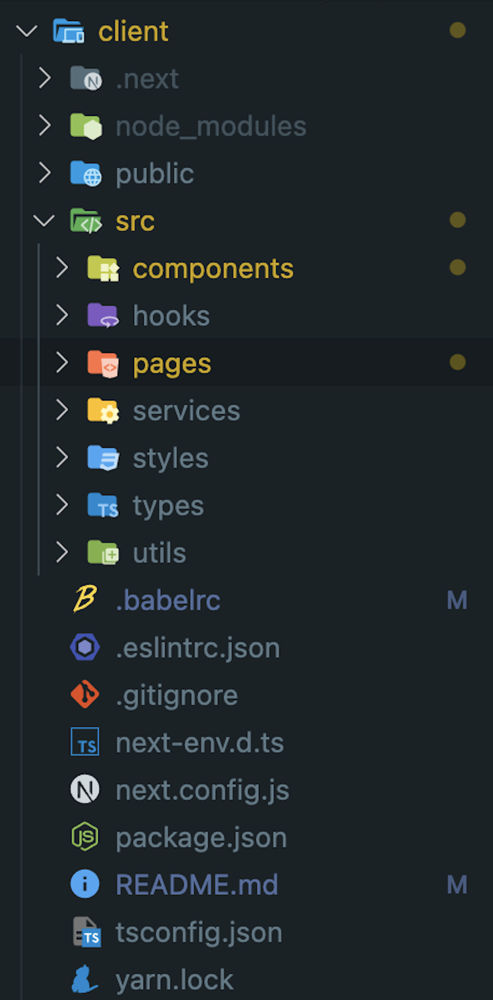

이 레포는 우아한 테크코스 과제를 구현한 결과물입니다.
Next.js / React-query 와 Json-server 를 통해 장바구니 담기, 주문 기능이 있는 애플리케이션 기능을 구현한 과정과, 참고할 만한 지식들을 정리했습니다.

#### tree

```JS
├── components
│   ├── Layout
│   │   └── Layout.tsx
│   ├── cart
│   │   ├── CartList.tsx
│   │   ├── cartItem
│   │   │   └── CartItems.tsx
│   │   └── style.ts
│   ├── common
│   │   ├── Button.tsx
│   │   ├── Checkbox.tsx
│   │   └── ErrorBanner.tsx
│   ├── gnb
│   │   └── Gnb.tsx
│   ├── info
│   │   ├── InfoWindow.tsx
│   │   └── style.ts
│   ├── order
│   │   ├── OrderDetailList.tsx
│   │   ├── OrderList.tsx
│   │   ├── orderItem
│   │   │   ├── OrderItems.tsx
│   │   │   └── style.ts
│   │   └── style.ts
│   ├── payments
│   │   ├── Payments.tsx
│   │   ├── paymentsItem
│   │   │   ├── PaymentsItem.tsx
│   │   │   └── style.ts
│   │   └── style.ts
│   └── product
│       ├── ProductDetailCard.tsx
│       ├── ProductList.tsx
│       └── productItem
│           ├── ProductItem.tsx
│           └── style.ts
├── hooks
│   ├── api
│   │   ├── useCartMutation.ts
│   │   └── useOrderMutation.ts
│   ├── useCalcCartList.ts
│   └── useConvert.ts
├── pages
│   ├── _app.tsx
│   ├── cart
│   │   └── index.tsx
│   ├── index.tsx
│   ├── orderComplete.tsx
│   ├── orders
│   │   ├── [orderId].tsx
│   │   └── index.tsx
│   ├── payments.tsx
│   └── products
│       └── [productId].tsx
├── services
│   └── api.ts
├── styles
│   ├── GlobalStyles.ts
│   ├── breakpoints.ts
│   ├── media.ts
│   ├── styled.d.ts
│   └── theme.ts
├── types
│   └── dto.ts
└── utils
    ├── constants.ts
    └── url.ts
```

### 🕹️ 실행 방법

```JS
// 필요한 dependency 설치
npm i or yarn

// cd server
yarn server

// cd client
yarn run dev
```

## 주요 구현 과정

## 1. 프로젝트 설정

### Install

Next.js 프로젝트를 TS로 설치
`yarn create next-app --typescript`

CSS-In-JS 인 Styled-Component 를 설치
`yarn add styled-components && npm i -D @types/styled-components`

### 바벨 (Babel JS) 설정

리액트에서는 Styled-component 를 사용하기 위해 따로 babel을 설정해주지 않아도 되지만, Next 는 스타일들이 적용되기 전에 렌더링이 완료되기 때문에 스타일이 적용되지 않는 현상을 방지하기 위해서는 babel을 설정해주어야 합니다. [styled-component 공식문서 참고](https://styled-components.com/docs/tooling)

(최초 SSR 이후 CSR 로 라우팅 하게 되는데 서버에서 생성되는 해시값과 브라우저의 해시값이 달라서 에러가 발생함(Prop className did not match) )

`yarn add --save-dev babel-plugin-styled-components`

```JS
{

"presets": ["next/babel"],

"plugins": [

[

"babel-plugin-styled-components",

{
"ssr":true, //클라이언트와 서버에서 서로 다른 클래스 생성으로 인한 체크섬 불일치를 방지합니다.

"fileName": true, //코드가 포함된 파일명을 알려줍니다.

"displayName": true, //태그 class명에 디렉토리, 컴포넌트명을 추가합니다.

"pure": true //사용하지 않은 속성을 제거합니다.

}]]
}
```

---

## 2. 디렉토리 구조

디렉토리 구조는 다음과 같습니다.



pages 디렉토리를 src 하위로 이동하였습니다.
Next.js 9 버전부터 pages 디렉토리를 src 디렉토리 하위에 놓는것을 공식적으로 지원해주고 있습니다. [공식문서 참고](https://nextjs.org/blog/next-9-1#src-directory-support)

### 구조 설명

`pages` 는 next 에서 routing 되는 페이지를 작성합니다.
`components` 에는 재활용이 가능한 컴포넌트들을 작성합니다.
`hooks` 에는 컴포넌트들에서 사용이 가능한 custum hooks 들을 작성합니다.
`services` 에는 server 와 통신하는 axios 코드를 작성합니다.
`styles` 에는 styled-component 로 작성한 글로벌 스타일 (+reset), 글로벌 theme, 미디어쿼리, 인터페이스 정의를 위한 styled.d.ts 를 작성합니다.
`types` 에는 타입스크립트이므로 각 api 명세에 맞는 타입들을 정의해줍니다.
`utills` 에는 공용으로 사용하는 API_ENDPOINT 와 페이지의 URL을 상수화 하여 관리하는 코드를 작성합니다.

## 3. Styled-component & Theme 설정

### GlobalStyle

```JS
import { createGlobalStyle } from "styled-components";

import reset from "styled-reset";


const GlobalStyles = createGlobalStyle`

${reset}

* {

box-sizing: border-box;

}

body{

font-family: -apple-system,system-ui,BlinkMacSystemFont,"Segoe UI",Roboto,"Helvetica Neue",Arial,sans-serif;

}

a {

color: inherit;

text-decoration: none;

}

input, button {

background-color: transparent;

border: none;

outline: none;

}

h1, h2, h3, h4, h5, h6{

font-family:'Maven Pro', sans-serif;

}

@media only screen and (max-width: 768px) {

body {

font-size: 12px;

}

}

@media only screen and (max-width: 576px) {

body {

font-size: 10px;

}

}

`;

export default GlobalStyles;
```

styled-reset을 사용하여 reset과 글로벌에 기본적인 미디어 쿼리를 함께 작성해주었습니다.

### Theme

```JS
import { DefaultTheme } from "styled-components";

export const colors = {

WHITE: "#FFF",

BLACK: "#000",

BLACK_OPACITY_70: "rgba(0,0,0,0.7)",

BLACK_OPACITY_25: "rgba(0,0,0,0.25)",

BLACK_TEXT: "#333333",

GRAY_10: "#AAAAAA",

GRAY_HEAD: "#F6F6F6",

GRAY_900_OPACITY_55: "rgba(30, 30, 30, 0.55)",

ORANGE_700: "#F37D3B",

CYAN: "#94DACD",

MINT_BLUE: "#2ac1bc",

};

export const fontSize = {

bigTitle: "28px",

title: "20px",

smtitle: "18px",

text: "16px",

smallText: "14px",

};

export type ColorsTypes = typeof colors;
export type FontSizeTypes = typeof fontSize;
const theme: DefaultTheme = {

colors,

fontSize,

};

export default theme;
```

프로젝트에서 사용할 color 와 fontSize 를 정의해주었습니다.
theme 에 대한 인터페이스 타입은 styled.d.ts 에 정의해주었습니다.

```JS
import { ColorsTypes, FontSizeTypes } from "./theme";
declare module "styled-components" {

export interface DefaultTheme {

colors: ColorsTypes;

fontSize: FontSizeTypes;

}}
```

```JS
import { ThemeProvider } from "styled-components";

import GlobalStyles from "src/styles/GlobalStyles";

import theme from "src/styles/theme";

import Layout from "src/components/Layout/Layout";


function MyApp({ Component, pageProps }: AppProps) {


return (

<ThemeProvider theme={theme}>

<GlobalStyles />

<Layout>

<Component {...pageProps} />

</Layout>

</ThemeProvider>

);

}

export default MyApp;

```

`_app.tsx ` 에서 ThemeProvider 에 theme을 주입하여 사용할 수 있습니다.

## 4. API 설정

서버는 미리 제공된 Json-server 를 사용했습니다.
HTTP 비동기 통신 라이브러리로는 axios 를 사용했습니다.

```JS
import { Product, Cart, Order, OrderItem } from "src/types/dto";

import { API_ENDPOINT } from "../utils/constants";

import axios from "axios";

export const api = axios.create({

baseURL: API_ENDPOINT,

});

api.defaults.withCredentials = true;
```

먼저 상수로 선언해놓은 `API_ENDPOINT` 를 baseURL 로 설정하여 axios instance 를 만들어줍니다. axios.create를 사용하면 custom 으로 axios instance 를 만들 수 있습니다.

axios 의 인스턴스를 생성해서 api 라는 변수에 담고 API 를 반환합니다.  
(withCredentials = true 는 cors 에러를 해결하기 위해 추가해주었습니다.)

```JS
//상품 단일 조회

export const getProductItem = async (itemId: string) => {

const response = await api.get<Product>(`products/${itemId}`);

return response.data;

};
```

반환받은 api 를 통해 `async await` 으로 콜백으로 처리하여 통신합니다. `async await`은 프로미스를 기반으로 동작하는 가장 최근에 나온 비동기 처리 문법입니다. promise 의 경우 콜백 패턴을 사용하기 때문에 .then() 과 같은 후처리 함수들이 콜백 헬과 같은 뎁스가 깊은 함수를 만들어 낼 수 있다는 점이 있습니다.

그러나 `async await` 을 사용하면 promise 의 단점을 보완하여 프로미스의 후처리 메소드 없이 동기 처리처럼 프로미스가 처리 결과를 반환하도록 구현할 수 있습니다.

```JS
export const addCartItem = async (product: Product) => {

try {

const res = await api.post<Product>("/carts", { product });

return res.data;

} catch {

console.log("product 추가 에러");

}};
```

Error Hanldling 을 위해 try-catch 문을 사용하고 싶다면 위와 같이 사용이 가능합니다.

## 5. React-Query

### 🤔 React-Query를 사용한 이유...

React-Query 는 React 앱에서 서버 상태를 가져오고 캐싱, 동기화,업데이트 하는 작업을 쉽게 만드는 `비동기 상태를 관리하는 라이브러리` 입니다.

처음 애플리케이션을 만들 때, 서버로부터 값을 가져오거나 업데이트 하는 로직을 redux toolkit 을 사용하여 store 내부에 구현하여 전역상태로 관리를 하려고 하였습니다 만...

리액트에서는 데이터를 가져오거나 업데이트하는 방법을 제공하지 않아 훅을 사용하거나 상태관리 라이브러리를 통해 구현해야 하는데, 기존의 redux,redux toolkit 등과 같은 상태 관리 라이브러리들이 클라이언트 상태 작업에 적합하고 비동기/서버 상태에는 적합하지 않다는 것을 알게 되었습니다.

다른 분들이 구현한 장바구니 코드를 찾아보니 비동기를 위하여 redux thunk 나 redux saga 와 같은 미들웨어를 사용한 상당히 복잡한 코드를 찾게 되었기 때문입니다.

비동기를 위해 미들웨어를 사용해 작성한 복잡한 비동기 코드를 보고 다른 미들웨어를 추가하여 복잡함을 그대로 받아들이기 보다는 이러한 고질적인 문제를 해결하기 위해 제시된 React-Query 를 사용해 보며 익히기로 마음 먹었습니다.

그 결과 React-Query 를 사용하여 서버와 클라이언트 데이터를 분리하여 작성하는 것의 의미와 편리성을 깨닫게 되었습니다.

또한 react-hook 과 사용하는 구조가 비슷하여 적용이 어렵지 않다고 느껴졌습니다.

### React-Query 사용하기

#### Install

`yarn install react-query` 로 react -query 를 설치해 줍니다.

#### APP

client 를 생성하고 생성한 client 를 QueryClientProvider 를 통해 앱에 제공해줍니다.

```JS
function MyApp({ Component, pageProps }: AppProps) {

const [queryClient] = useState(() => new QueryClient());

return (

<ThemeProvider theme={theme}>

<GlobalStyles />

<QueryClientProvider client={queryClient}>

<Component {...pageProps} />

<ReactQueryDevtools initialIsOpen={false} />

</QueryClientProvider>

</ThemeProvider>

);
}

export default MyApp;

```

queryClient 를 생성했으면 리액트 쿼리가 제공하는 `query` 를 사용할 수 있게 된 것입니다.

#### query

- **query** : 유니크한 key 에 바인딩된 비동기 데이터를 가져오는 선언적 종속성으로 데이터를 fetch 하는 모든 프로미스 기반 메서드 (get,post)와 함께 사용할 수 있습니다. (만약 서버 데이터를 수정하는 경우에는 mutation을 사용하여 수정할 수 있습니다.)
- **useQuery** : useQuery 훅을 사용하여 컴포넌트에서 쿼리를 호출하여 사용할 수 있습니다. (각 쿼리당 유니크한 키 데이터와 프로미스를 반환하는 함수를 지정하여 사용하면 됩니다.)

```JS
const { data } = useQuery("/carts", getCartItems);
```

위와 같이 `useQuery`를 사용하여 아래의 카트의 데이터를 get 해올 수 있습니다.

```JS
//clent > src > services > api.ts의 getCartItems
export const getCartItems = async () => {
try {
const response = await api.get<Cart[]>("carts");
return response.data;
} catch (error) {
console.log(`cartItem fetch 에러${error}`);
}};
```

또한 `useQuery`의 경우 반환된 쿼리 결과에 쿼리의 현재 status가 포함되어있어 상태에 따른 분기처리가 쉽게 가능합니다.

```JS
	const {status, data, error} = useQuery("todos",fetchTodoList)

	if(status ==="loading"){
		return <span>Loading...</span>
	}
	if(status ==="error"){
		return <span>Error: {error.message}</span>
	}

	return(
		<ul>
			{data.map(todo=>(
				<li key={todo.id}>{todo.title}</li>
			))}
		</ul>
	)
```

#### Mutations

서버의 데이터를 수정하는 경우 `Mutations` 을 사용할 수 있습니다. return 값은 useQuery 와 동일합니다.

카트에 담긴 목록을 삭제하는 클릭핸들러에서 deleteCartList 를 호출해 주었습니다.

```JS
const { deleteCartList, updatedcartSelctedAll } = useCartMutation();

const clickHandler = () => {
deleteCartList(cartSelectedIdList);
};
```

deleteCartList 는 useCartMutation 에 정의된 useMutaion 함수의 반환값이며 선택한 카트리스트의 아이디 값을 넘겨 받아 카트를 삭제하는 deleteCarts 를 호출합니다.

```JS
const deleteCartListMutation = useMutation(

(cartIdList: number[]) => deleteCarts(cartIdList),

afterMutaitionHandler

);
```
